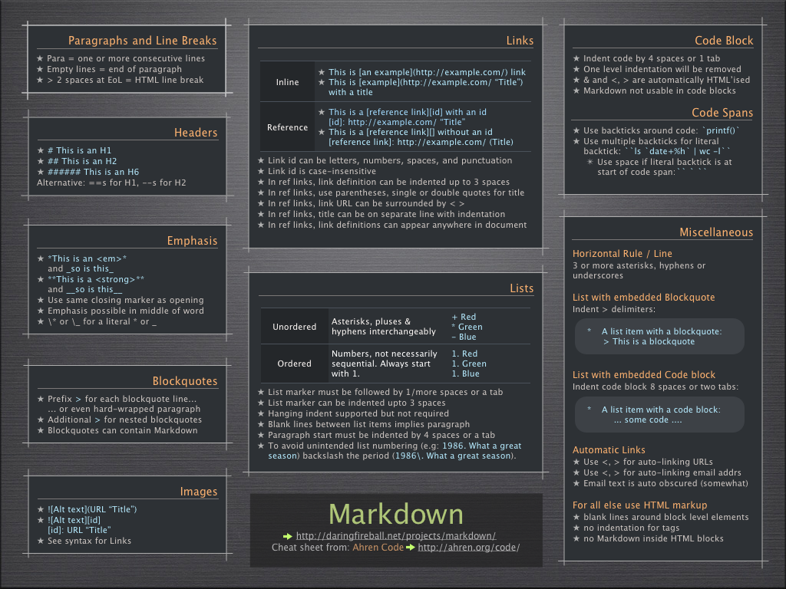

# Markdown Syntax Documentation.

## Syntax to display a single line of text in the format of heading.    
   * To create a heading, add one to six # symbols before your heading text. The number of # you 
        use will determine the size of the heading. There shpuld be at least one space between the number sign 
        and the title string.
     
  Example:
         # I love Dogs
         
         ## I love Dogs
         
         
         
      
   Output:
# I love Dogs
   
## I love Dogs
    
   
## Syntax for Styling any text.
   * For text in "BOLD" add two asterisks or underscores before and after a word or phrase.  
   * For text in "ITALIC" add one asterisk or underscore before and after a word or phrase.
   * For text in "BOLD AND ITALIC" at the same time add three asterisks or underscores before and after a word or phrase.
   
   Desired Output for the above three:
   
   1. My dog name is **tuffy**
   1. My dog name is *tuffy*
   1. My dog name is ***tuffy***
   
## Syntax for Blockquotes.
   
   1. To create a blockquote, add a > in front of a paragraph.
   1. To create a blockquotes with multiple paragraphs we need to always a > on the blank lines between the paragraphs.
   
   Rendered output for the above three looks like:
   
   * > Tuffy is the best.
  
   * > Dogs love meatjerks.
   >
   > Dogs are loyal and the cutest.
  
## Syntax to include Images.
  
   * To insert Images the format should be in the following manner that is first we need to insert !(exclamatory mark) followed by []square brackets where inside the brackets you can include alternate text and then lastly followed by parenthesis () inside which you can include the image address.
      
   * Alternate text is displayed if the image is not loaded. Also used for accessibility.

   * URL is the address of the image to display.

   * Hover title (optional) is the text displayed when the pointer is hovering over the image. Also used for accessibility.
   
   * Desired output by following the correct syntax:
   
   
   
   
   
   
   
   
## Syntax to create a link
   
   * To create a link, enclose the link text in brackets (e.g., [markdownguide]) and then follow it immediately with the URL in parentheses (e.g., (https://www.markdownguide.org)).
   
   * The rendered output looks like the below if correct syntax is followed:
   
   * My favorite markdown "go to" website is [Markdownguide](https://www.markdownguide.org).
   
   * If looking for Online video tutorial check out the given link [Markdown video tutorial](https://www.youtube.com/watch?v=6A5EpqqDOdk&t).
   
   * Another link for learning Markdown language is [Mastering Markdown](https://guides.github.com/features/mastering-markdown).
   
   * In the given pdf link [Markdown guide](https://www.markdownguide.org/assets/book/markdown-guide.pdf) one can refer to complete markdown guide.

## Syntax for Paragraphs

  * When we want to create a paragraph in markdown we need to amek sure that we leave a blan line between blocks of text or else the     whole text will be collapsed in a single paragraph.So if we require space between two sentences we need to make sure we leave a blank line between them.
